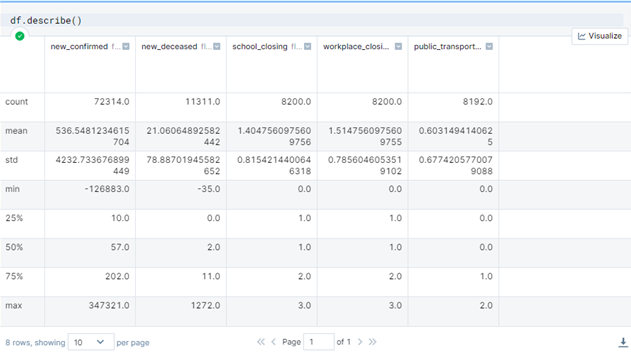
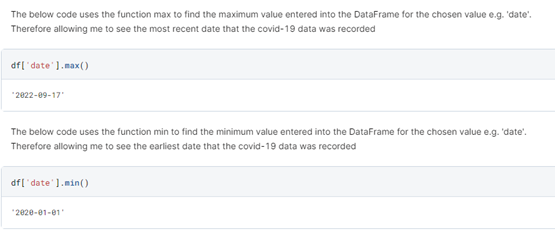
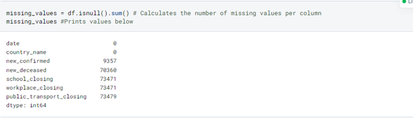
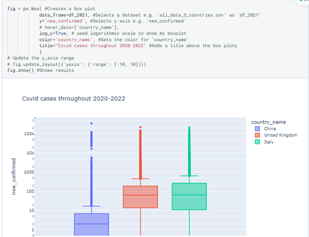
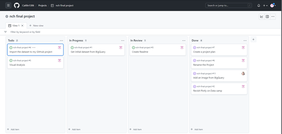

# NCH Final Project
 
- [Introduction/Project Requirements](#Introduction)
- [Rationale](#Rationale)
- [Obtaining Data](#Obtaining-Data)
- [Schema](#Schema)
- [Tech Stack](#Tech-Stack)
- [Team & Processes](#Team-&-Processes)
- [Data Exploration](#Data-Exploration)
- [Data Cleaning](#Data-Cleaning)
- [Visual Analysis](#Visual-Analysis)
- [Processes](#Processes)
- [Conclusion](#Conclusion)

[Link to my Deepnote](https://deepnote.com/workspace/caitlin1306-5830-b744c156-1215-41b0-afc0-861533a29a82/project/NCH-Bootcamp-f2ebe341-884e-42c0-b194-dc0e178c25ee/notebook/NCH%20Final%20Project%20-8e630e6780274171848330c518ff31c7)

[Link to my project plan](https://docs.google.com/document/d/1OuMQPu6PXZGiezz-ZZQXcmpNE61Zj6OXMKqFOeeDLMM/edit)

[Link to my presentation](https://slides.com/caitlino-keefe/palette/edit)

[Link to my dataset on BigQuery](https://console.cloud.google.com/bigquery?authuser=1&project=principal-fact-363111&ws=!1m5!1m4!4m3!1sbigquery-public-data!2scovid19_open_data_eu!3scovid19_open_data)

## Introduction

To complete the Data Analytics course at [Northeastern University London](https://www.nulondon.ac.uk/), I had to produce the final project to fulfill the following criteria:

- Provide the project rationale.
- Utilize a minimum of 3 technologies, e.g., [Pandas](https://pandas.pydata.org/docs/), [Plotly](https://plotly.com/python/) & [Standard SQL](https://cloud.google.com/bigquery/docs/reference/standard-sql/introduction)
- Collect feedback, i.e., make pull requests on [GitHub](https://docs.github.com/en), adding @missKatiaPunter  & @T-J-Summer  as reviewers 
- Use data visualization, i.e., bar charts 📊, scatter plots & line charts etc. 
- Document the project in [GitHub](https://docs.github.com/en), [Deepnote](https://deepnote.com/docs), [Google Docs](https://www.google.com/docs/about/) & [Slides.com](https://slides.com/)
- Apply Agile methodologies, i.e., [Kanban Boards](https://github.com/topics/kanban)
- Use some statistical and machine learning analysis
- Reach a conclusion 

## Rationale

### Why did I choose this topic for my project?

Coronavirus disease (COVID-19) is an infectious disease caused by the [SARS-CoV-2](https://www.who.int/emergencies/diseases/novel-coronavirus-2019) virus. 

If infected with the virus, you may experience mild to moderate respiratory illness if infected with the virus and recover without medical assistance. However, some will become seriously ill and require medical attention. Coronavirus affects all ages and individuals differently depending on factors such as age, lifestyle, health, etc.

The main reason for choosing this dataset is because **COVID-19** was and still is a huge part of all our lives, due to it being a global disease, and I wanted a dataset that I would feel passionate about digging into and the **"covid19_open_data".** I have selected on [BigQuery](https://cloud.google.com/bigquery/docs/) allows me to analyse and compare factors that increased the chances of more individuals dying or catching the disease, such as, the more schools closed, did fewer people die due to the disease.

Secondly, there was an extraordinary range of government responses that happened worldwide when COVID-19 started spreading, which led to their being a vast amount of data to explore and compare. They included:

- Closures of schools, train stations, and aeroports,
- Emergency investments in healthcare,
- Travel restrictions,
- Contact tracing,
- Emergency welfare provisions,
- Investments in vaccinations,
- Many other interventions.

Nowadays, it is paramount to investigate those measures' comparative effectiveness in case another pandemic happens. Albeit a beginner data analyst, I wanted to do one of such analytic explorations.


## Obtaining Data

Video link?

### Where did I get my data?

I got my data from a [BigQuery](https://cloud.google.com/bigquery/docs/) public dataset.
I started with exploring my data using [standard SQL](https://cloud.google.com/bigquery/docs/reference/standard-sql/introduction).
My first query was the one below 👇.
```
SELECT
  MAX(date) as end_date,
  MIN(date) as start_date
FROM
  `bigquery-public-data.covid19_open_data_eu.covid19_open_data`;
```
When I run the query above, I got the following result: 


After running my first query, I decided to run a query that would find out how many countries where recorded in my dataset 👇.

```
SELECT
  DISTINCT country_name,
  country_code
FROM
  `bigquery-public-data.covid19_open_data_eu.covid19_open_data`
ORDER BY
  country_code;
```
When I run the query above, it produced the following result:


### Why did I choose my data?

As stated above, the main reason for choosing this dataset is because **COVID-19** was and still is a huge part of all our lives due to it being a global disease, and I wanted a dataset that I would feel passionate about digging into and the **"covid19_open_data"** seemed precisely that. I have selected BigQuery as it is a part of [the Google Cloud](https://cloud.google.com/docs) and subsequently very fast. Moreover, it allows me to use [Standard SQL](https://cloud.google.com/bigquery/docs/reference/standard-sql/introduction) to analyse and filter the data before uploading it to a Jupyter notebook. In this project, I wanted to compare the effects of different government response actions, e.g., school closures, transport closures, vaccinations, etc. 

> My ultimate goal was to identify the government response most effectively fighting the pandemic.

## Schema
| Name | Type | Description | Example |
| ---- | ---- | ----------- | ------- |
| **date** | `Date` |(YYYY-MM-DD)| 2020-05-07 |
| **new_confirmed** | `Integer` | Count of new cases confirmed after positive test on this date | 64.0 |
| **new_deceased** | `Integer` | Count of new deaths from a positive COVID-19 case on this date | 9.0 |
| **country_name** | `String` | Name of each country where the data has been recorded for| United Kingdom |
| **school_closing** | `Integer` | Record to show how each country responded to covid-19 on this date eg 0 - means weak response, 3 - means very strong | 1 |
| **workplace_closing** | `Integer` | Record to show how each country responded to covid-19 on this date eg 0 - means weak response, 3 - means very strong | 2 |
| **public_transport_closing** | `Integer` | Record to show how each country responded to covid-19 on this date eg 0 - means weak response, 3 - means very strong | 3 |

**new_confirmed** - Values can be negative, typically indicating a correction or an adjustment in the way they were measured. For example, a case might have been incorrectly flagged as recovered one date so it will be subtracted from the following date.

## Tech Stack

For my project, I have chosen the following stacks:

- [Standard SQL](https://cloud.google.com/bigquery/docs/reference/standard-sql/introduction)
- [Pandas](https://pandas.pydata.org/docs/)
- [Plotly](https://plotly.com/python/)
- [Seaborn](https://seaborn.pydata.org/tutorial/introduction)

## Team and Processes

### Team

|Name|Github|
| :------: | :----------------------------------------------------------------------------------------------: | 
|  Katia - **Team Lead**   | [](https://github.com/missKatiaPunter)
|  Caitlin - **Data Analyst**  | [](https://github.com/Caitlin1306)
|  Theo - **Data Analyst**  | [](https://github.com/T-J-Summer/Final-Project)

## Data Exploration
 
[Link to my Deepnote](https://deepnote.com/workspace/caitlin1306-5830-b744c156-1215-41b0-afc0-861533a29a82/project/NCH-Bootcamp-f2ebe341-884e-42c0-b194-dc0e178c25ee/notebook/NCH%20Final%20Project%20-8e630e6780274171848330c518ff31c7)

Data exploration helps us to achieve a basic understanding of the chosen data. The results of data exploration can be extremely useful in understanding the dataset's structure. Descriptive statistics condenses critical characteristics of the data set into simple numeric metrics such as mean, maximum, standard deviation, etc.

Below are several screenshots of descriptive statistics for my dataset `bigquery-public-data.covid19_open_data_eu.covid19_open_data` that I got from running the codes **df.describe()**, **df.head()**, **df.info()** and **df.max/df.min** 👇.

`.describe()` is used for calculating summative statistics, e.g., percentile, mean, and standard deviation of the numerical values of the DataFrame. It analyzes numeric series and the DataFrame columns of mixed data types.



`.head(5)` returns the first 5 n rows in the DataFrame.

.png)

`.info()` function is used to get a concise summary of the dataframe. It comes in handy when doing exploratory data analysis, as seen below.

.png)

The below code uses the function max/min, to see the most recent & earliest date that the covid-19 data was recorded.




## Data Cleaning 

Data cleaning is a process used to determine inaccurate, incomplete, or unreasonable data and then improve quality by correcting detected errors and omissions. 
Without cleaning a dataset, you may come across duplication, negative values and missing values. 
When cleaning the covid-19 dataset, I realized it had exactly that, when I ran the below code 👇.

The below code searches the dataset for negative values that have been entered into the DataFrame


The below code searches the dataset for missing values and shows which columns have missing values and how many.



The below code searches the dataset for missing values, however, shows how much information is missing from the DataFrame in total.


## Visual Analysis

Visual Analytics is important as it is an extremely powerful way to make sense of huge amounts of data. 
Visual analytics was an extremely important part of my project, as mentioned above it allowed to analyze and compare factors that increased the chances of more individuals dying or catching the disease, such as the more schools closed, did fewer people die due to the disease. Not only did it allow me to view my code and come to a clearer understanding, but it also allowed me to improve my own coding and have fun at the same time experimenting with what works and what doesn't.

The below screenshot shows a choropleth map that I used to represent my three chosen countries e.g. Italy, Japan & United Kingdom using color.


The below screenshot shows a line chart that I used to show the covid cases throughout 2020-2022 for my three chosen countries e.g. Italy, Japan & United Kingdom using color.


The below screenshot also shows a line chart and I used it to visualize the deaths due to covid throughout 2020-2022 for my three chosen countries e.g. Italy, Japan & United Kingdom using color. 


The below screenshot is another method of visualization I used to show the covid cases throughout 2020-2022 for my three chosen countries e.g. Italy, Japan & United Kingdom using color. I searched the same values as the first line chart above but decided to use a different method of visualization to be able to compare results from differnt angles to be able to get the most from it.




## Processes

The basic Kanban board from GitHub Projects was used for Project Management 👇



### Why did I use a Kanban board?

A Kanban board is an agile project management tool designed to help visualize work, limit work-in-progress, and maximize efficiency. I chose to use a Kanban board because it allowed me to group my project tasks into sections such as "To Do," "In Progress," "In Review" and "Done." This was very beneficial because I knew what needed to be done first and what I was waiting on a response for and could leave for a moment It also allowed me to see how long I was spending on a task helping me to manage my time better. I only had 3 weeks to complete my final project and time management was vital.

## Conclusion 

